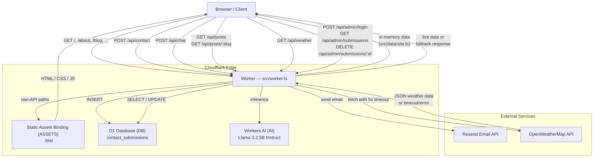

# High-Level Design

## Overview

The portfolio is a single Cloudflare Worker (`sricharanchowdary`) that serves Astro-generated static assets **and** a JSON API surface, all from one deployment. Every HTTP request enters the Worker's `fetch` handler, which routes `/api/*` paths to business logic and falls through to `env.ASSETS.fetch()` for everything else.

## Component Diagram

## Components and Responsibilities

| Component | Location | Responsibility |
|---|---|---|
| **Worker** | `src/worker.ts` | Single `fetch` entry point. Routes requests, validates input, orchestrates calls to bindings and external services. |
| **Contact Library** | `src/lib/contact.ts` | Shared validation logic (`validateContactInput`) and the `jsonResponse` helper used by all routes. |
| **Site Data** | `src/data/site.ts` | Static content: projects, blog posts, nav items, site metadata. Imported at module scope by the Worker. |
| **Static Assets** | `./dist` (via `ASSETS` binding) | Astro-built HTML, CSS, JS, images. Served for any request that doesn't match an `/api/*` route. |
| **D1 Database** | Cloudflare D1 (`DB` binding) | Persists contact form submissions. Supports soft delete via `is_deleted` flag. |
| **Workers AI** | Cloudflare AI (`AI` binding) | Powers the `/api/chat` endpoint using Llama 3.2 3B Instruct for a portfolio Q&A assistant. |
| **Resend** | External API | Sends email notifications for valid contact submissions. Gated behind `RESEND_API_KEY`. |
| **OpenWeatherMap** | External API | Provides real-time weather data for Hyderabad. Called with a 5-second timeout and graceful fallback. |

## Data Stores

| Store | Type | Contents |
|---|---|---|
| D1 `contact-submissions-db` | Relational (SQLite) | `contact_submissions` table — id, name, email, message, submitted_at, is_deleted |
| `src/data/site.ts` | In-memory (module) | Blog posts, projects, nav items — no database needed for read-only portfolio content |

## Secrets and Bindings

| Name | Type | Purpose |
|---|---|---|
| `ASSETS` | Workers Static Assets binding | Serves `./dist` for non-API routes |
| `DB` | D1 Database binding | Contact form persistence |
| `AI` | Workers AI binding | Chat inference |
| `RESEND_API_KEY` | Wrangler secret | Authenticates email sends via Resend |
| `CONTACT_TO_EMAIL` | Wrangler secret | Destination address for contact emails |
| `ADMIN_PASSWORD` | Wrangler secret | Admin login credential (HMAC-signed session cookie) |
| `WEATHER_API_KEY` | Wrangler secret | Authenticates requests to OpenWeatherMap |
| `ANTHROPIC_API_KEY` | Wrangler secret | Reserved for future Anthropic integration |
