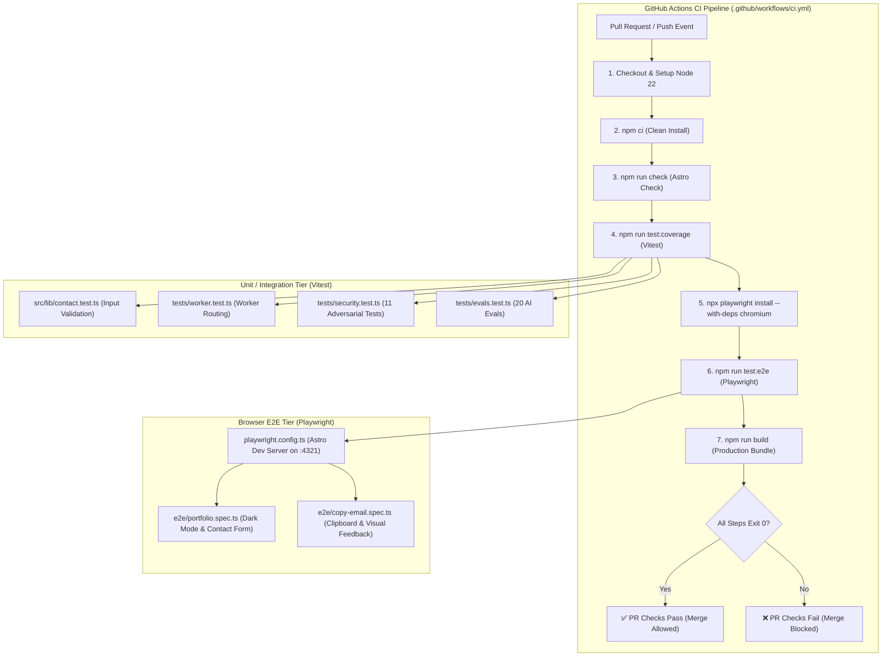

# High-Level Design (HLD) — Automated Testing & CI Pipeline

This document outlines the testing architecture for the Sri Charan Portfolio web application, integrating unit, integration, adversarial, and browser-based end-to-end (E2E) testing with automated GitHub Actions CI/CD gates.

---

## 1. System Architecture & Testing Layers

The testing pyramid is organized into three distinct tiers for speed, reliability, and coverage:

1. **Static Analysis & Type Checking (Astro Check / TypeScript)**:
   - Validates template syntax, TypeScript types, and Astro component props at compile time.
2. **Fast Unit, API & Eval Layer (Vitest)**:
   - Executes 50 test cases covering contact validation, Worker endpoints, adversarial prompt injection defense, and 20 LLM résumé chatbot evals.
   - Runs in-memory with sub-second execution and V8 code coverage analysis.
3. **Browser End-to-End Layer (Playwright)**:
   - Spins up Chromium instances against a local Astro web server (`http://localhost:4321`).
   - Tests user journeys: theme persistence in `localStorage`, contact form submission feedback, and clipboard API copying.

---

## 2. Component Diagram

---

## 3. Key Components & Responsibilities

| Component | Technology | Primary Responsibility |
| :--- | :--- | :--- |
| **Test Runner (Unit/API)** | [Vitest](https://vitest.dev/) | Ultra-fast unit testing, ESM module execution, mock Workers runtime, and AI eval suite. |
| **Test Runner (E2E)** | [Playwright](https://playwright.dev/) | Real browser DOM testing, clipboard permissions, storage persistence, and form submission flows. |
| **CI Orchestrator** | [GitHub Actions](https://github.com/features/actions) | Enforces quality gates on every Pull Request, runs all test suites, and blocks merges on test failures. |
| **Development WebServer** | Astro CLI (`astro dev`) | Automatically spawned by Playwright's `webServer` config to serve the frontend on `http://localhost:4321`. |
| **Coverage Engine** | `@vitest/coverage-v8` | Generates code coverage metrics (`lcov.info`) to track test completeness across backend libraries. |
