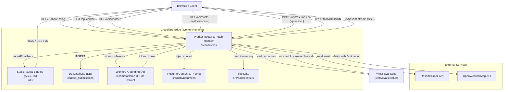

# High-Level Design

## Overview

The portfolio is a single Cloudflare Worker (`sricharanchowdary`) that serves Astro-generated static assets, dynamic REST APIs, and an AI-powered streaming résumé chatbot (`/api/resume-chat`) backed by Cloudflare Workers AI. Every HTTP request enters the Worker's `fetch` handler, routing API calls to edge business logic and falling through to `env.ASSETS.fetch()` for static assets.

An automated evaluation harness (`tests/evals.test.ts`) verifies the chatbot against 20 behavioral, factual, and safety test cases using Vitest.

## Component Diagram

## System Components and Responsibilities

| Component | Location | Responsibility |
|---|---|---|
| **Worker Entrypoint** | `src/worker.ts` | Single `fetch` router. Handles request validation, streaming SSE responses, authentication, and service orchestration. |
| **Resume Data & Grounding** | `src/data/resume.ts` | Stores the canonical `RESUME_TEXT` and `RESUME_SYSTEM_PROMPT` containing strict behavioral boundaries and refusal rules. |
| **Evaluation Suite** | `tests/evals.test.ts` | Automated Vitest test harness with 20 distinct test cases verifying factual recall, salary refusal, hallucination resistance, and API limits. |
| **Workers AI Engine** | Cloudflare `AI` binding | Executes `@cf/meta/llama-3.2-3b-instruct` at edge data centers with streaming token output. |
| **Posts & Site Data** | `src/data/posts.ts`, `src/data/site.ts` | In-memory store for projects, blog posts, and site metadata. |
| **Contact & Admin DB** | Cloudflare D1 (`DB`) | SQLite store for contact submissions with soft delete support. |
| **Static Assets** | `./dist` via `ASSETS` | Astro pre-rendered static HTML, CSS, JavaScript, and images. |
| **Weather API** | External OWM | Supplies real-time weather with 5s timeout and guaranteed fallback payload. |

## Data Flow: Chat & Evaluation

### 1. User Chat Flow
1. **Request**: The client sends a `POST /api/resume-chat` with `{ question: string }`.
2. **Validation**: The Worker verifies HTTP method, ensures the body is valid JSON, checks non-empty input, and caps length at 500 characters.
3. **Context Injection**: The Worker retrieves `RESUME_SYSTEM_PROMPT` (containing `RESUME_TEXT` and strict refusal rules) and pairs it with the user question.
4. **Inference**: The Worker calls `env.AI.run('@cf/meta/llama-3.2-3b-instruct', { messages: [...], stream: true })`.
5. **Streaming Response**: The Worker wraps the resulting `ReadableStream` into a `text/event-stream` response with `Cache-Control: no-cache`.

### 2. Evaluation Flow
1. **Test Execution**: Vitest launches `tests/evals.test.ts`.
2. **Mock / Live Stream**: The test runner dispatches requests to `worker.fetch()` with diverse evaluation questions.
3. **Stream Assembly**: Helper functions read the SSE stream chunks and reassemble the full output string.
4. **Assertion**: Regex and exact match assertions verify factual precision, salary refusal, hallucination rejection, and length constraints.

## Bindings and Secrets

| Name | Type | Purpose |
|---|---|---|
| `AI` | Workers AI Binding | Cloudflare Workers AI model inference (`llama-3.2-3b-instruct`) |
| `ASSETS` | Static Assets Binding | Serves Astro build artifacts from `./dist` |
| `DB` | D1 Database Binding | Contact submission storage in `contact_submissions` |
| `WEATHER_API_KEY` | Wrangler Secret | API key for OpenWeatherMap integration |
| `RESEND_API_KEY` | Wrangler Secret | API key for Resend email notifications |
| `ADMIN_PASSWORD` | Wrangler Secret | HMAC secret token generator for admin authentication |
