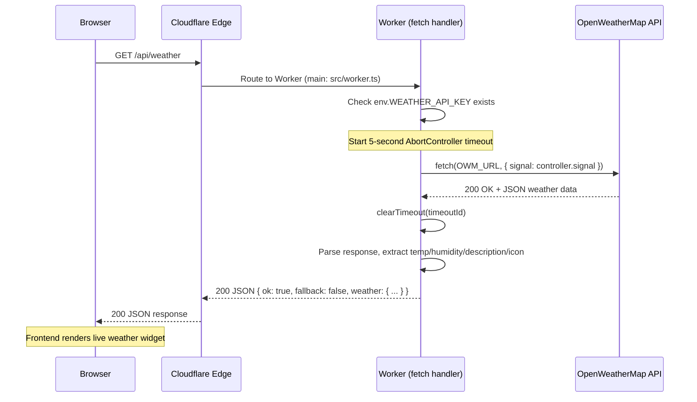
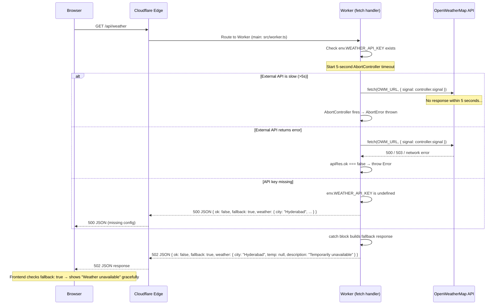
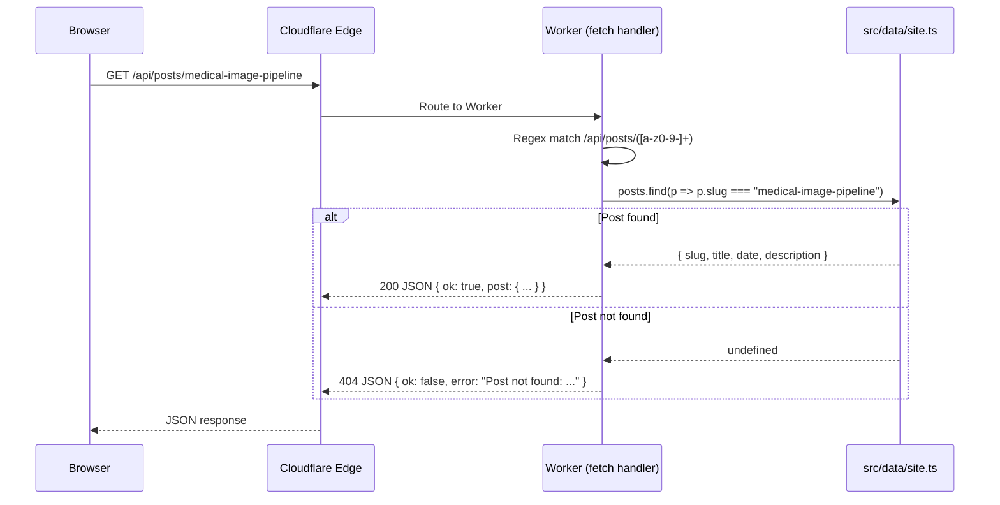
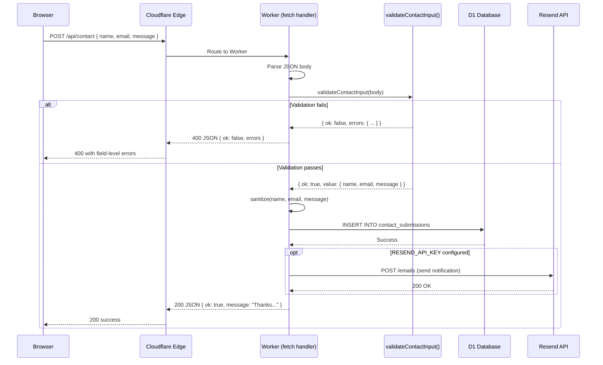

# Sequence Diagrams

## 1. Weather API — Happy Path (External API succeeds)

## 2. Weather API — Failure Path (External API slow/down)

## 3. Posts API — Slug Lookup

## 4. Contact Submission — Full Flow

